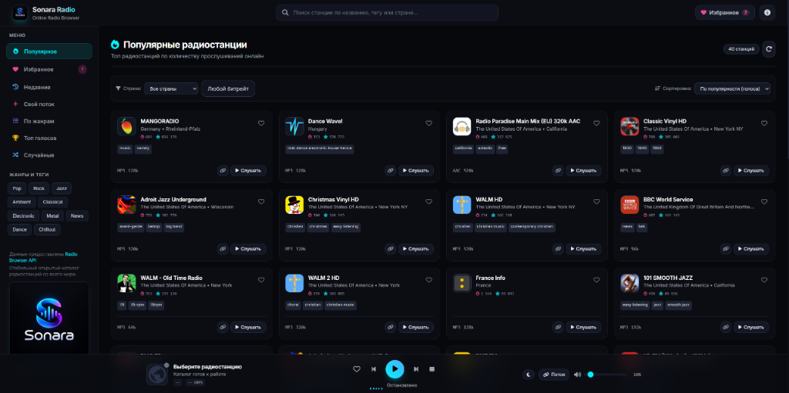
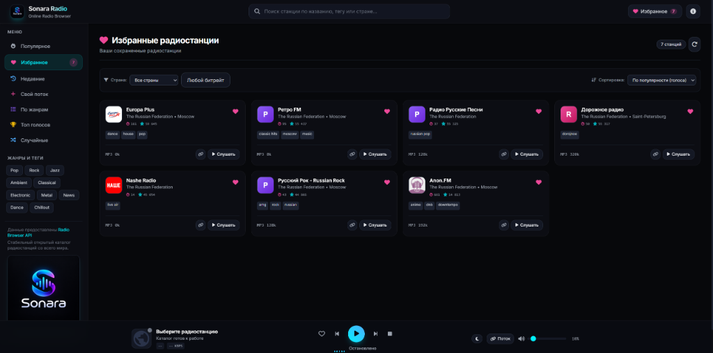

# 📻 Sonara Radio v2.3.2

**Sonara Radio** — веб-плеер для прослушивания радиостанций со всего мира. Приложение использует статический каталог, который ежедневно обновляется из открытых данных [Radio Browser](https://www.radio-browser.info/), и работает как Progressive Web App (PWA).

---

## 📸 Скриншоты

| Главный экран — Популярные | Раздел Избранное |
|---|---|
|  |  |

---

## ✨ Ключевые фишки и особенности

### 🚀 Архитектура и Производительность
- **Progressive Web App (PWA):** Благодаря `manifest.json` и `sw.js` (Service Worker), радио можно установить как полноценное приложение на Windows, macOS, Android и iOS прямо из браузера. Кэширование интерфейса обеспечивает мгновенный запуск.
- **Precompiled Tailwind CSS:** Полный отказ от тяжелых CDN-компиляторов. Стили скомпилированы и встроены в HTML (Zero runtime cost).
- **Автономный HLS (.m3u8):** Библиотека `hls.js` (v1.5.17) поставляется локально (`vendor/hls.min.js`) и кэшируется Service Worker. Потоки HLS декодируются нативно без зависимости от внешних CDN. *(Примечание: шрифты Inter и иконки FontAwesome загружаются с CDN и при полном отсутствии сети деградируют до системных шрифтов).*
- **Статический каталог:** GitHub Actions каждый день скачивает экспорт Radio Browser, проверяет его и публикует облегчённый `data/stations.json`. Браузер ищет и фильтрует станции локально. Если файл недоступен, приложение пробует зеркала API, затем показывает небольшую встроенную подборку.
- **Избранное без API:** Метаданные прослушанных и добавленных в избранное станций сохраняются в браузере, поэтому для их повторного открытия не обязателен запрос по UUID.

### 🎨 Интерфейс и UX
- **Светлая и тёмная темы:** Переключатель в шапке меняет оформление всего интерфейса и сохраняет выбор в браузере.
- **Кинематографичные анимации:** Использование аппаратного **View Transitions API** для плавного (cross-fade) переключения между разделами и вкладками.
- **Умные SVG-заглушки (Smart Fallbacks):** Если у станции отсутствует логотип или сервер радиостанции отдал нерабочую картинку (битая ссылка), Sonara Radio генерирует красивую SVG-иконку с первой буквой названия станции.
- **Тёмная тема (Glassmorphism):** Стильный дизайн с использованием эффекта матового стекла (`backdrop-blur`), неоновых акцентов и моноширинных шрифтов для битрейта.
- **Динамический CSS-эквалайзер:** Плавная аппаратная CSS-анимация спектра, синхронизированная со статусом воспроизведения потока, работающая со 100% станций без задержек и ограничений CORS.

### 🎛 Функционал плеера
- **Быстрый комбинированный поиск:** Параллельный поиск по названию станций и жанровым тегам с защитой от race-condition через `activeRequestId`.
- **Локальные фильтры без потери контекста:** Фильтрация по ISO кодам стран и битрейту работает мгновенно поверх текущего экрана («Избранное», «История», «Поиск», «Жанры») без перезагрузки данных из API.
- **История и Свои потоки:** Автоматическое сохранение 20 последних прослушанных станций и возможность добавления собственных `.mp3` / `.m3u8` потоков. Для пользовательских станций клики не отправляются во внешний API.
- **Media Session API:** Интеграция с ОС: управление с экрана блокировки Windows/Android/macOS (Play/Pause, Next, Prev), обложка и метаданные.
- **Sleep Timer & Безопасное выключение ПК:** Таймер сна с возможностью остановки воспроизведения или выключения компьютера. Перед выключением пользователю выводится предварительное подтверждение в браузере, затем нативный системный диалог с 25–30 секундным таймаутом на отмену через `shutdown /a`. Предусмотрен деинсталлятор `uninstall-shutdown.bat`.
- **Резервное копирование (Экспорт / Импорт):** Полное сохранение избранного и собственных добавленных станций в JSON (формат v1) с поддержкой обратной совместимости для старых backup-файлов и строгой валидацией типов данных.

---

## 🛠 Технический стек

- **Frontend:** HTML5, Vanilla JavaScript (ES2022)
- **Стилизация:** Tailwind CSS (скомпилированный)
- **Иконки:** FontAwesome
- **Медиа:** HTML5 Audio API, HLS.js (локальный вендор `vendor/hls.min.js`)
- **Каталог:** `data/stations.json` из ежедневного [экспорта Radio Browser](https://backups.radio-browser.info/); живой API используется как резерв.

---

## 🚀 Установка и Использование

Sonara Radio не требует базы данных или сложной установки.

Ежедневная выгрузка запускается workflow `Update radio catalog`; его можно запустить вручную через Actions → Run workflow. При ошибке скачивания или неполном экспорте прежний файл остаётся в репозитории. При запуске HTML через `file://` каталог загружается с `raw.githubusercontent.com`; внутри файла также есть небольшая резервная подборка. Доступность самих аудиопотоков зависит от их владельцев и сети пользователя.

1. **Для стандартного использования** просто откройте `index.html` в любом современном браузере. Приложение полностью работоспособно при прямом локальном запуске (`file://`).
   В релизе есть отдельный `sonara-radio.html`: это вариант в одном файле со встроенными `sonara-core.js`, HLS и установщиком выключения ПК. Для установки PWA используйте полный ZIP.
   Собрать такой файл из исходников можно командой `node scripts/build-standalone.js sonara-radio.html`.
2. **Для установки как PWA (на рабочий стол/экран телефона):** браузеры требуют безопасный контекст (HTTPS или `localhost`). Обычный запуск через `file://` для PWA не подойдёт. Запустите любой локальный HTTP-сервер, например:
   - `npx http-server` (в папке проекта)
   - Расширение Live Server в VSCode
   - `python -m http.server`
   После этого перейдите по адресу `localhost` и в браузере появится кнопка установки приложения.
3. **Для активации функции "Выключить ПК" (Windows):**
   - Запустите `install-shutdown.bat` от имени пользователя (он создаст обработчик безопасного протокола в `%LOCALAPPDATA%\SonaraRadio`).
   - Для деинсталляции и очистки реестра запустите `uninstall-shutdown.bat`.

---

## 🧪 Тестирование и CI

В репозитории настроен автоматический тестовый набор и GitHub Actions CI:

```bash
node tests/run-tests.js
```

Тесты запускают общий `js/sonara-core.js` и основной скрипт приложения в Node VM. Они проверяют валидацию хранилища, backup v1 и legacy, восстановление своей станции, HLS recovery, работу загрузчиков и поздний ответ Explore. Также проверяются JS-синтаксис, manifest, Service Worker, размеры PNG и файлы выключения ПК. Ручной запуск в Chrome через localhost дополняет эти проверки.

---

## 📜 История версий (Changelog)

### v2.3.2 (Текущая стабильная версия)
- Добавлена светлая тема и переключатель с сохранением выбора. Обновлён кэш Service Worker для нового оформления.
- К ZIP добавлен отдельный `sonara-radio.html` для запуска без папок с JS-файлами.

### v2.3.1
- Экспорт и импорт реально используют backup v1 с избранным и своими станциями; старые массивы избранного принимаются.
- Последняя пользовательская станция восстанавливается локально, без запроса к Radio Browser и без автозапуска.
- Объявлен activeRequestId; смена раздела отменяет ожидание поиска и инвалидирует старые запросы. loadStations защищён от позднего ответа.
- Восстановлены отсутствовавшие playStreamUrl() и addToHistory(); попытки HLS recovery ограничены.
- Проверяемые функции вынесены в js/sonara-core.js; тесты используют тот же код и запускают основной скрипт в VM.
- Service Worker кэширует общий JS и использует новый ключ кэша.

### v2.3
- Добавлены безопасная вставка данных в DOM, локальная фильтрация по странам, локальный `vendor/hls.min.js` и скрипты выключения ПК.
- В опубликованной сборке оставались ошибки backup, восстановления своих станций, конкурентных запросов и воспроизведения. Их исправляет v2.3.1.

### v1.0 (Первый релиз)
- Базовая реализация плеера на Vanilla JavaScript и Tailwind CSS.
- Подключение к публичному каталогу Radio Browser API.
- Функция таймера сна с локальным протоколом `sonarashutdown:`.
- Сохранение избранных радиостанций в `localStorage` браузера.

---

## 📄 Лицензия

Проект распространяется под свободной лицензией MIT. Подробности в файле [LICENSE](LICENSE).

**Автор:** Александр Коваленко, 2026.
